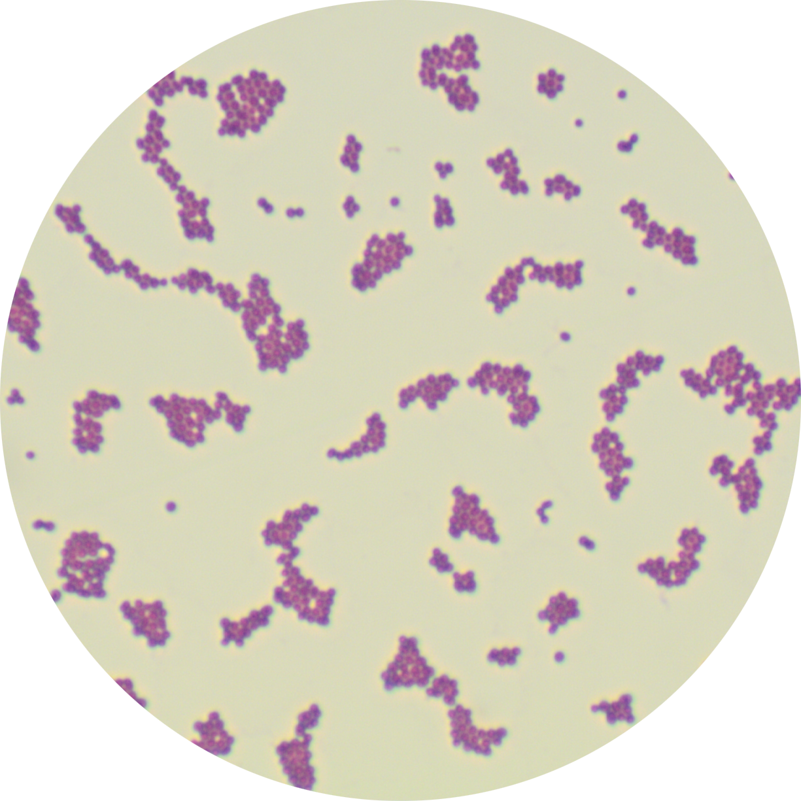
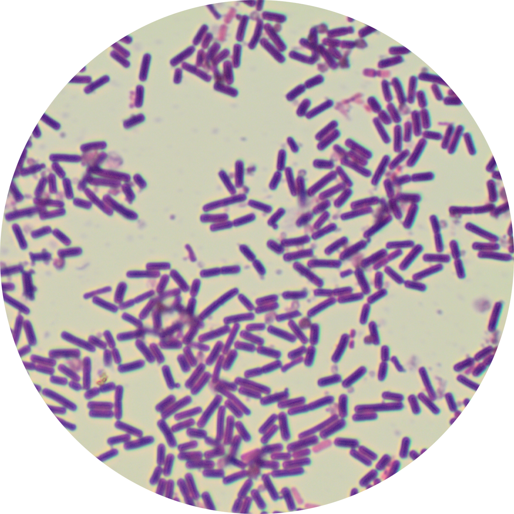
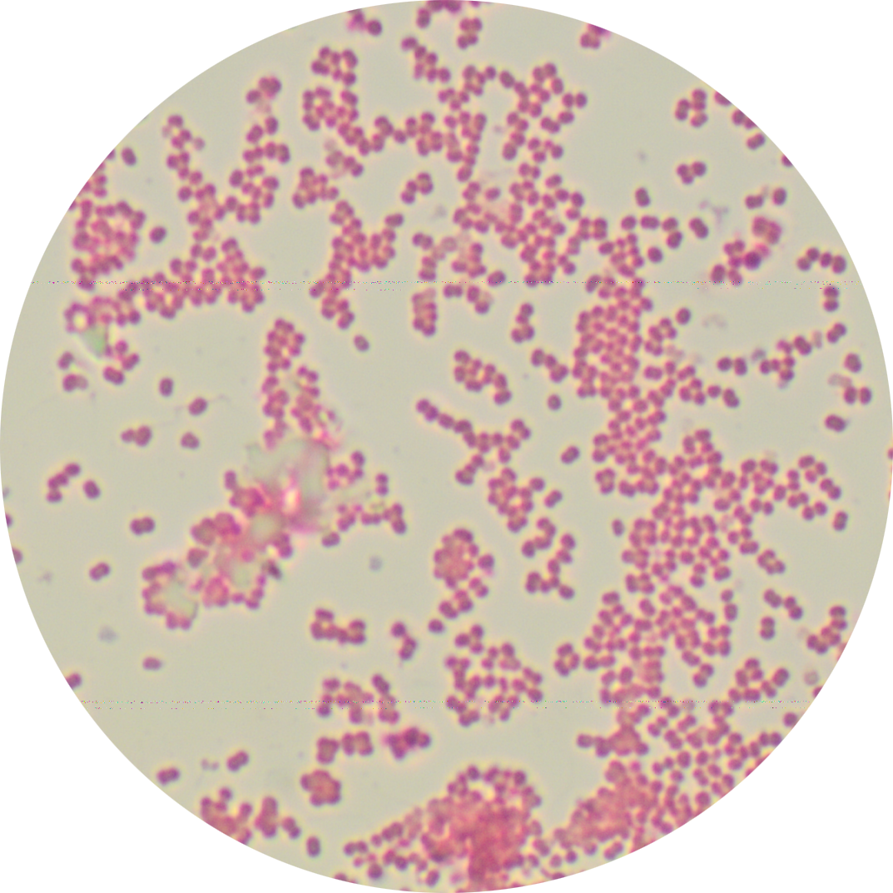
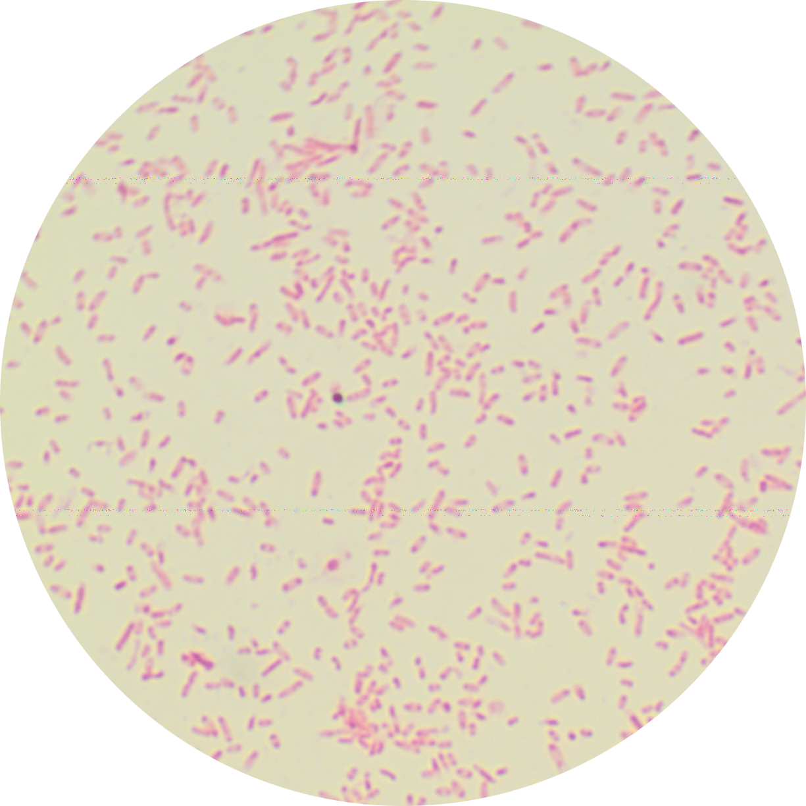
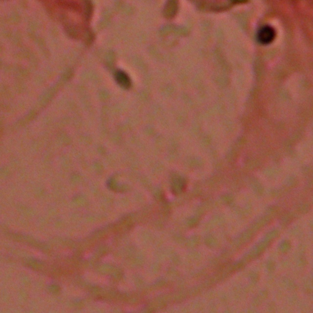
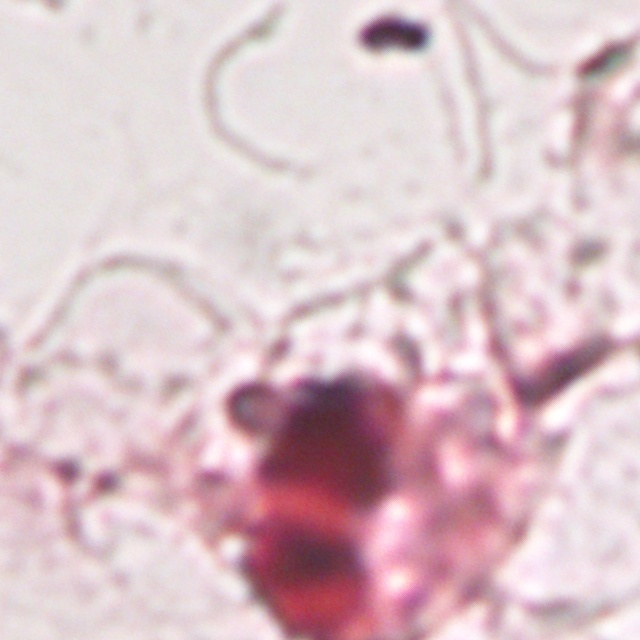
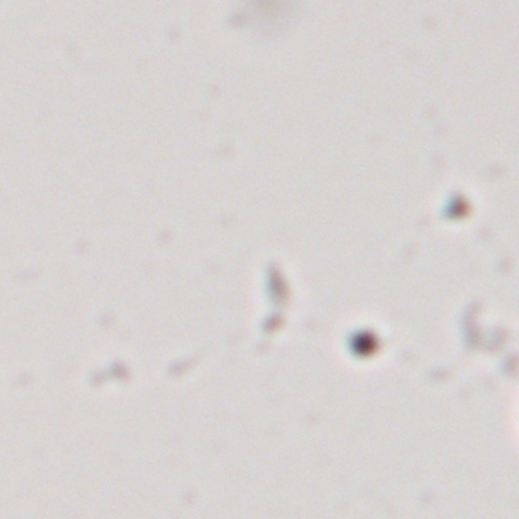
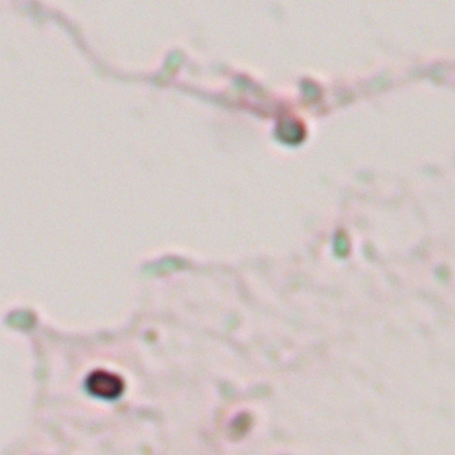

# Dataset Notes

This project uses two dataset sources under `Data/`:

- `Clinical Specimen`
- `Pure Culture`

The detection task is defined with four classes:

- Gram-negative cocci
- Gram-positive cocci
- Gram-negative bacilli
- Gram-positive bacilli

## Source Datasets

### Pure Culture

Source: [Bacteria Data for Machine Vision and Digital Biology](https://data.mendeley.com/datasets/cvkgfzp7ck/1)

The original public data was organized at the species level. For this project, the dataset was manually reviewed and regrouped into the four Gram-stain categories above.

Roboflow was also used in the annotation workflow for the pure culture data after regrouping, so it is reasonable to mention Roboflow here as part of the project-side data preparation pipeline.

The original source archives included:

- `Listeria monocytogenes-20230901T011812Z-001.zip`
- `Micrococcus spp-20230901T011903Z-001.zip`
- `Neisseria gonorrhoeae-20230901T012222Z-001.zip`
- `Porphyromonas gingivalis-20230901T012259Z-001.zip`
- `Propionibacterium acnes-20230901T010956Z-001.zip`
- `Proteus-20230901T011822Z-001.zip`
- `Pseudomonas aeruginosa-20230901T011907Z-001.zip`
- `Staphylococcus aureus-20230901T012237Z-001.zip`
- `Staphylococcus epidermidis-20230901T012301Z-001.zip`
- `Staphylococcus saprophyticus-20230901T010959Z-001.zip`
- `Streptococcus agalactiae-20230901T011824Z-001.zip`
- `Veillonella-20230901T011913Z-001.zip`

Important note:

- the `Pure Culture` folder in this repository is not the raw public dataset
- it is a manually selected and reorganized working subset
- the current folder structure reflects the project class design, not the original public archive layout

The labels currently stored for `Pure Culture` are prediction-derived labels under `predict/labels/`, so they should be treated as pseudo-labels rather than manually verified ground truth.

### Clinical Specimen

Source: [Clinical Bacteria DataSet](https://zenodo.org/records/10526360)

The clinical dataset in this repository is used as the main annotated detection dataset.

Its current working structure is:

- `Data/Clinical Specimen/images`
- `Data/Clinical Specimen/labels`
- `Data/Clinical Specimen/txt`

## Class Mapping

The class IDs used in the clinical YOLO label files are interpreted as:

| Class ID | Class Name |
| --- | --- |
| 0 | Gram-negative cocci |
| 1 | Gram-positive cocci |
| 2 | Gram-negative bacilli |
| 3 | Gram-positive bacilli |

## Repository Interpretation

For this repository, the datasets should be understood as:

- `Clinical Specimen`: main manual detection dataset
- `Pure Culture`: supporting pure culture dataset regrouped from public species-level sources

In short, `Pure Culture` is a curated project-specific subset, while `Clinical Specimen` is the main detection dataset used for analysis and model development.

## Example Images

### Pure Culture

| Class | Example |
| --- | --- |
| Gram-positive cocci |  |
| Gram-positive bacilli |  |
| Gram-negative cocci |  |
| Gram-negative bacilli |  |

Asset filenames:

- `pure_culture_poscoc.png`
- `pure_culture_posbac.png`
- `pure_culture_negcoc.png`
- `pure_culture_negbac.png`

### Clinical Specimen

| Class | Example |
| --- | --- |
| Gram-positive cocci |  |
| Gram-positive bacilli |  |
| Gram-negative cocci |  |
| Gram-negative bacilli |  |

Asset filenames:

- `clinical_poscoc.jpg`
- `clinical_posbac.jpg`
- `clinical_negcoc.jpg`
- `clinical_negbac.jpg`
